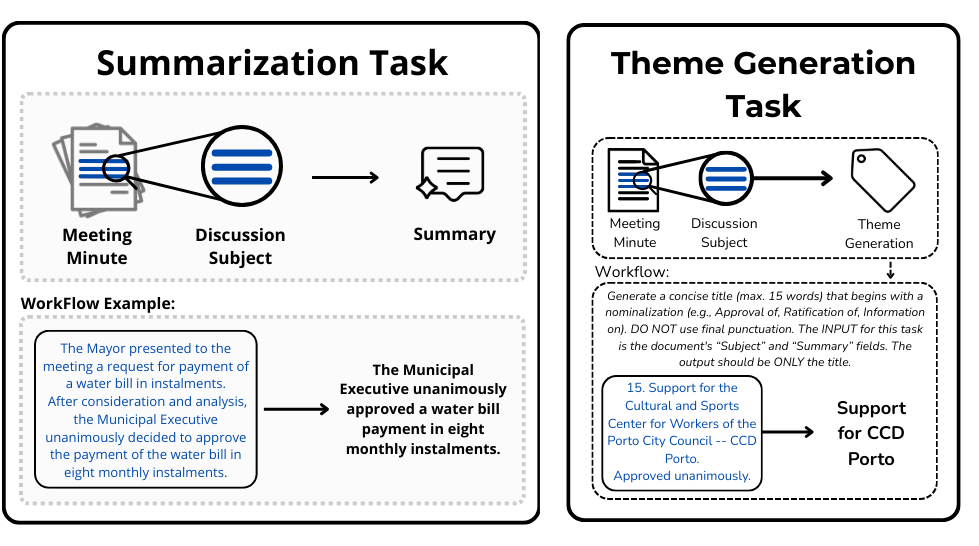
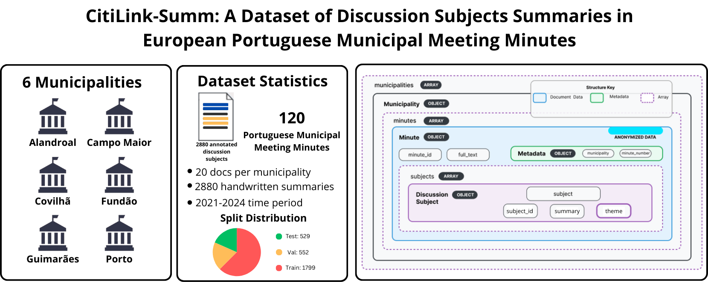

# CitiLink: Segment-Level Text Summarizatio in Municipal Meeting Minutes

[](https://creativecommons.org/licenses/by-nd/4.0/)
[](https://www.python.org/downloads/)
[](https://pytorch.org/)

This repository presents a generation task for structured summaries of subjects of discussion from Municipal Meeting Minutes in European Portuguese using the mBART-50 model as base.  It includes training and evaluation scripts for three experimental settings: a general model, intra-municipality specialization, and leave-one-municipality-out generalization.

> **🎯 Try the summarization and theme generation models Now**: Test the models interactively at [https://huggingface.co/spaces/liaad/CitiLink-Theme-Generation-and-Segment-Level-Summarization-Demo](https://huggingface.co/spaces/liaad/CitiLink-Theme-Generation-and-Segment-Level-Summarization-Demo)

> **Get the summarization and theme generation models**: https://huggingface.co/collections/liaad/citilink

<div align="center">
    
</div>

---

## Table of Contents

1. [Description](#description)
2. [Project Status](#project-status)
3. [Technology Stack](#technology-stack)
4. [Dependencies](#dependencies)
5. [Installation](#installation)
6. [Repository Structure](#repository-structure)
7. [Usage](#usage)
   - [Segment-Level Summarization](#segment-level-summarization)
   - [Theme Generation](#theme-generation)
8. [Dataset](#dataset)
9. [Architecture](#architecture)
   - [Segment-Level Summarization Pipeline](#segment-level-summarization-pipeline)
   - [Theme Generation Pipeline](#theme-generation-pipeline)
10. [Evaluation Metrics](#evaluation-metrics)
11. [Experimental Settings & Results](#experimental-settings--results)
    - [Segment-Level Summarization Results](#segment-level-summarization-results)
    - [Theme Generation Results](#theme-generation-results)
12. [Known Issues](#known-issues)
13. [License](#license)
14. [Resources](#resources)
15. [Acknowledgments](#acknowledgments)
16. [Citation](#citation)

---

## Description

The system addresses two complementary tasks for Portuguese municipal meeting minutes:

- **Segment-Level Summarization** — Summarizing the content of each subject of discussion using recursive chunking and theme-aware prompting, fine-tuned on `facebook/mbart-large-50`.
- **Theme Generation** — Generating a concise theme/title (up to 15 words) for each subject of discussion using instruction-prompted fine-tuning on `facebook/mbart-large-50-many-to-many-mmt`.

### Key Features

- **Recursive Chunking** (Summarization): A recursive function that calculates how many context-window chunks are needed to cover both the input text and the target summary. It then splits both the text and summary into aligned shards, guiding the model with part indicators (`[PARTE: i/N]`).
- **Theme-Aware Prompting** (Summarization): Along with fine-tuning, prompting is used to guide the model with structured input containing the theme and chunk position (e.g., `RESUMIR [TEMA: theme] [PARTE: 1/3] [TEXTO]: ...`).
- **Instruction Prompting** (Theme Generation): The model is fine-tuned with an instruction prefix that guides concise theme generation with nominalized beginnings (e.g., "Sumariza o segmento de ata num tema conciso...").
- **Fine-Tuning**: `facebook/mbart-large-50` for summarization; `facebook/mbart-large-50-many-to-many-mmt` for theme generation.
- **Cross-Municipality Evaluation**: A leave-one-municipality-out strategy to test generalization to unseen locations.
- **Intra-Municipality Evaluation**: Training and testing using data from a specific municipality (specialization).
- **General Model**: A single model trained on the full training set and evaluated on the held-out test set.
- **Reproducible Experiments**: All code is made available to ensure all presented results are reproducible.

---

## Project Status

✅ The summarization and theme generation models are **fully implemented and validated** for research use. The codebase is actively maintained to ensure reproducibility of the published results.

- **Sample Data**: Available in `dataset_sample/sample.json`
- **Train/Val/Test Split**: Available in `split_info.json` (temporal split strategy, 60/20/20)
- **Full Dataset**: Available through the [CitiLink-Summ repository](https://github.com/INESCTEC/citilink-summ)

---

## Technology Stack

**Language**: Python

**Core Frameworks**:
- **PyTorch**: Deep learning backend for tensor computations, gradient calculation, and GPU acceleration during training.
- **Hugging Face Transformers**: Used for loading the mBART-50 models, tokenization, and the `Seq2SeqTrainer` API for training.
- **Hugging Face Datasets**: Used for managing, structuring, and applying batched transformations to the training data.

**Key Libraries**:
- `pandas`: Tabular data manipulation for structuring extracted segments into DataFrames.
- `json`: Parsing the hierarchical JSON structure of the municipal minutes dataset.
- `evaluate` / `rouge_score` / `sacrebleu` / `bert_score`: Evaluation metric computation (ROUGE, BLEU, METEOR, BERTScore).
- `nltk`: Tokenization for METEOR computation.
- `tqdm`: Progress bars during inference.
- `os`: Directory and path management for model checkpoints and output files.

---

## Dependencies

### Core Dependencies

- **`transformers`** (>=4.30.0) — Load the mBART-50 models, handle tokenization, and run the `Seq2SeqTrainer`.
- **`torch`** (>=2.0.0) — PyTorch backend for tensor operations, gradient accumulation, and GPU-accelerated training.
- **`datasets`** (>=2.14.0) — Hugging Face library for efficient batch processing and data splitting.
- **`pandas`** (>=2.0.0) — Structuring parsed JSON data into tabular format.
- **`evaluate`** — Hugging Face evaluation metrics library.
- **`rouge-score`** — ROUGE metric computation.
- **`sacrebleu`** — BLEU metric computation.
- **`bert-score`** — BERTScore metric computation.
- **`nltk`** — Natural language tokenization for METEOR.

### Optional Dependencies

- **`accelerate`** (>=0.21.0) — Required by the Trainer for mixed-precision training (`fp16`) and optimized memory usage.
- **`sentencepiece`** (>=0.1.99) — Subword tokenization library required by the mBART tokenizer.

### Installing Dependencies

```bash
pip install transformers torch datasets pandas accelerate sentencepiece evaluate rouge-score sacrebleu bert-score nltk tqdm
```

For PyTorch with CUDA support (match your NVIDIA driver version):
```bash
pip install torch --index-url https://download.pytorch.org/whl/cu118
```

---

## Installation

### Prerequisites
- Python 3.10 or higher
- CUDA-capable GPU recommended (at least 16 GB VRAM for fine-tuning mBART-50)
- At least 16 GB system RAM

### Setup Steps

1. **Clone the repository**
```bash
git clone https://github.com/INESCTEC/summarizing_meeting_minutes_in_European_Portuguese_with_mBART-50.git
cd summarizing_meeting_minutes_in_European_Portuguese_with_mBART-50
```

2. **Create and activate a virtual environment**
```bash
python -m venv venv
source venv/bin/activate
```

3. **Install dependencies**
```bash
pip install transformers torch datasets pandas accelerate sentencepiece evaluate rouge-score sacrebleu bert-score nltk tqdm
```

4. **Place the dataset**

The full dataset JSON (`citilink_summ_v2.json`) should be placed in a `dataset/` folder at the repository root:
```
dataset/citilink_summ_v2.json
```
The full dataset can be obtained from the [CitiLink-Summ repository](https://github.com/INESCTEC/citilink-summ).

5. **Verify installation**
```bash
python -c "import torch; from transformers import AutoTokenizer; print('CUDA Available:', torch.cuda.is_available()); AutoTokenizer.from_pretrained('facebook/mbart-large-50')"
```

---

## Repository Structure

```
.
├── README.md
├── split_info.json                              # Train/Val/Test file-level split (temporal, 60/20/20)
├── summarization_guidelines.pdf                 # Summarization annotation guidelines
├── dataset_sample/
│   └── sample.json                              # Sample of the dataset structure
├── assets/                                      # Images for documentation
│
├── Segment-level_Summarization/                 # ── TASK 1: Segment-Level Summarization ──
│   ├── general_model/                           # General model (train on all, test on held-out set)
│   │   ├── TRAIN_recursive_mbart-50.py          # Training with recursive chunking & prompting
│   │   ├── TEST_generate_summaries.py           # Inference (generates summaries for test set)
│   │   ├── get_metrics.py                       # Compute ROUGE, BLEU, METEOR, BERTScore
│   │   └── summaries_and_results/
│   │       ├── generated_summaries.json         # Generated summaries
│   │       ├── evaluation_results.json          # Overall evaluation metrics
│   │       └── evaluation_results_all_municipalities.csv
│   │
│   ├── in_municipality/                         # Intra-municipality (train & test per municipality)
│   │   ├── TRAIN_recursive_mbart.py             # Training (one model per municipality)
│   │   ├── get_metrics.py                       # Per-municipality evaluation metrics
│   │   └── summaries_and_results/
│   │       ├── generated_summaries.json
│   │       └── evaluation_results.json
│   │
│   └── leave_one_municipality_out/              # Leave-one-out (train on N-1, test on held-out)
│       ├── TRAIN_recursive_mbart-50.py          # Training (one model per held-out municipality)
│       ├── TEST_generate_summaries.py           # Inference + evaluation
│       ├── get_metrics.py                       # Detailed per-municipality metrics
│       └── summaries_and-results/
│           ├── generated_summaries.json
│           └── evaluation_results.csv
│
└── Theme_Generation/                            # ── TASK 2: Theme Generation ──
    ├── general_model/                           # General model (train on all, test on held-out set)
    │   ├── TRAIN_mbart-50.py                    # Training with instruction prompting
    │   ├── TEST_generate_themes.py              # Inference + evaluation on test set
    │   ├── get_metrics.py                       # Standalone metric computation
    │   └── summaries_and_results/
    │       └── mbart_evaluation_results.json    # Generated themes + evaluation
    │
    ├── in_municipality/                         # Intra-municipality (train & test per municipality)
    │   ├── TRAIN_mbart-50.py                    # Training (one model per municipality)
    │   ├── get_metrics.py                       # Per-municipality evaluation
    │   └── summaries_and_results/
    │       └── metricas_finais_municipios.csv   # Per-municipality results
    │
    └── leave_one_municipality_out/              # Leave-one-out (train on N-1, test on held-out)
        ├── TRAIN_mbart-50.py                    # Training (one model per held-out municipality)
        ├── get_metrics.py                       # LOO evaluation
        └── summaries_and_results/
            └── loo_evaluation_results.csv       # Per-municipality LOO results
```

---

## Usage

### Segment-Level Summarization

#### 1. General Model

The general model trains a single mBART-50 on the full training split and evaluates on the test split.

**Train:**
```bash
cd Segment-level_Summarization/general_model
python TRAIN_recursive_mbart-50.py
```
This applies recursive chunking with theme-aware prompts, fine-tunes `facebook/mbart-large-50`, and saves the final model to `results_mbart50_recursive_v1/citilink_recursive_final/`.

**Generate summaries on the test set:**
```bash
python TEST_generate_summaries.py
```
Outputs generated summaries to `summaries_and_results/generated_summaries.json`.

**Evaluate:**
```bash
python get_metrics.py
```
Computes ROUGE-1/2/L/Lsum, BLEU, METEOR, and BERTScore (Precision, Recall, F1).

---

#### 2. Intra-Municipality Model

Trains a separate model for each municipality using only that municipality's training data, then evaluates on that municipality's test data. This tests specialization.

**Train (all municipalities):**
```bash
cd Segment-level_Summarization/in_municipality
python TRAIN_recursive_mbart.py
```
Creates one fine-tuned model per municipality under `in_muni_only/<municipality>/final_model/`.

**Evaluate:**
```bash
python get_metrics.py
```

---

#### 3. Leave-One-Municipality-Out

Trains one model per municipality where that municipality is excluded from training, then tests on the excluded municipality. This tests generalization.

**Train (all leave-one-out folds):**
```bash
cd Segment-level_Summarization/leave_one_municipality_out
python TRAIN_recursive_mbart-50.py
```
Creates one model per fold under `loo_models_mbart/train_without_<municipality>/final_model/`.

**Generate summaries & evaluate:**
```bash
python TEST_generate_summaries.py
```

**Detailed per-municipality metrics:**
```bash
python get_metrics.py
```

---

### Theme Generation

#### 1. General Model

Trains a single mBART-50-many-to-many-mmt model with instruction prompting for theme generation.

**Train:**
```bash
cd Theme_Generation/general_model
python TRAIN_mbart-50.py
```
Fine-tunes `facebook/mbart-large-50-many-to-many-mmt` with instruction-prefixed inputs. The model learns to generate concise themes (max 15 words) starting with nominalizations. Saves the final model to `results_mbart50_ata_summarization/final_model/`.

**Generate themes & evaluate:**
```bash
python TEST_generate_themes.py
```
Loads the trained model, generates themes for the test set, computes ROUGE/BLEU/METEOR/BERTScore, and saves results to `summaries_and_results/mbart_evaluation_results.json`.

**Standalone metric computation:**
```bash
python get_metrics.py
```

---

#### 2. Intra-Municipality Model

Trains a separate theme generation model for each municipality using only that municipality's training data from the pre-defined split.

**Train (all municipalities):**
```bash
cd Theme_Generation/in_municipality
python TRAIN_mbart-50.py
```
Creates one fine-tuned model per municipality under `results_mbart50_individual_muni/train_test_<municipality>/final_model/`.

**Evaluate:**
```bash
python get_metrics.py
```
Outputs per-municipality metrics to `summaries_and_results/metricas_finais_municipios.csv`.

---

#### 3. Leave-One-Municipality-Out

Trains one theme generation model per municipality where that municipality is excluded from training.

**Train (all leave-one-out folds):**
```bash
cd Theme_Generation/leave_one_municipality_out
python TRAIN_mbart-50.py
```
Creates one model per fold under `results_mbart50_loo_temas/loo_without_<municipality>/final_model/`.

**Evaluate:**
```bash
python get_metrics.py
```
Outputs per-municipality metrics to `summaries_and_results/loo_evaluation_results.csv`.

---

### Key Hyperparameters

#### Segment-Level Summarization — General Model

| Parameter | Value |
|-----------|-------|
| Base Model | `facebook/mbart-large-50` |
| Max Input Length | 600 tokens |
| Max Target Length | 400 tokens |
| Learning Rate | 2e-5 |
| Batch Size | 1 (with 16 gradient accumulation steps) |
| Epochs | 5 |
| Weight Decay | 0.01 |
| Mixed Precision | fp16 (if CUDA available) |

#### Segment-Level Summarization — Leave-One-Out / In-Municipality

| Parameter | Value |
|-----------|-------|
| Base Model | `facebook/mbart-large-50` |
| Chunk Max Length | 1024 tokens |
| Chunk Stride | 512 tokens |
| Target Max Length | 128 tokens |
| Learning Rate | 2e-5 |
| Batch Size | 2 |
| Epochs | 3 |
| Warmup Ratio | 10% of total steps |
| Weight Decay | 0.01 |

#### Theme Generation — General Model

| Parameter | Value |
|-----------|-------|
| Base Model | `facebook/mbart-large-50-many-to-many-mmt` |
| Max Input Length | 1024 tokens |
| Max Target Length | 150 tokens |
| Batch Size | 8 |
| Epochs | 3 |
| Warmup Steps | 500 |
| Weight Decay | 0.01 |
| Mixed Precision | fp16 (if CUDA available) |

#### Theme Generation — In-Municipality

| Parameter | Value |
|-----------|-------|
| Base Model | `facebook/mbart-large-50-many-to-many-mmt` |
| Max Input Length | 1024 tokens |
| Max Target Length | 150 tokens |
| Batch Size | 4 |
| Epochs | 5 |
| Weight Decay | 0.01 |

#### Theme Generation — Leave-One-Out

| Parameter | Value |
|-----------|-------|
| Base Model | `facebook/mbart-large-50-many-to-many-mmt` |
| Max Input Length | 1024 tokens |
| Max Target Length | 150 tokens |
| Batch Size | 4 |
| Epochs | 3 |

---

## Dataset

> **⚠️ Important Note**:
> The GitHub repository for the paper **CitiLink-Summ: A Dataset of Discussion Subjects Summaries in European Portuguese Municipal Meeting Minutes**, presenting the dataset and summarization baselines, is available at https://github.com/INESCTEC/citilink-summ.

### Overview

<div align="center">
    
</div>

This dataset contains 2885 subjects of discussion from Portuguese municipal meeting minutes annotated with summaries, themes, and topics.

### Dataset Statistics

| Attribute | Value |
|-----------|-------|
| Subjects of Discussion | 2885 |
| Number of Municipalities | 6 |
| Administrative Term | 2021–2024 |
| Number of Minutes | 120 |
| Train / Val / Test Split | 72 / 24 / 24 documents |
| Split Strategy | Temporal |

### Municipalities

Alandroal, Campo Maior, Covilhã, Fundão, Guimarães, Porto

### Dataset Structure

```json
{
  "municipalities": [
    {
      "municipality": "Municipality name",
      "minutes": [
        {
          "minute_id": "ID",
          "full_text": "Full minute text",
          "agenda_items": [
            {
              "text": "Complete text of the subject of discussion",
              "topics": ["Topic 1", "Topic 2"],
              "theme": "Short Title / Theme",
              "summary": "Human-annotated summary"
            }
          ]
        }
      ]
    }
  ]
}
```

### Data Files

- [dataset_sample/sample.json](dataset_sample/sample.json) — Sample of the dataset structure with real examples
- [split_info.json](split_info.json) — Train/validation/test document-level split (temporal strategy)

### Using the Dataset

For instructions about dataset usage, consult the [dataset GitHub repository](https://github.com/INESCTEC/citilink-summ). The full dataset can be accessed through it.

---

## Architecture

### Segment-Level Summarization Pipeline

The summarization pipeline is built around `mBART-large-50` fine-tuned for segment-level summarization of Portuguese municipal meeting minutes. The key components are:

1. **Data Loading & Filtering** — Parses the hierarchical JSON dataset, extracts text segments with their summaries and themes, and filters based on the train/test split.
2. **Recursive Chunking** — Calculates how many context-window shards are needed to cover a long input text and its corresponding summary, then splits both into aligned chunks.
3. **Theme-Aware Prompting** — Each chunk is wrapped in a structured prompt: `RESUMIR [TEMA: <theme>] [PARTE: i/N] [TEXTO]: <chunk_text>`, providing the model with the theme and positional context.
4. **Fine-Tuning** — The `Seq2SeqTrainer` from Hugging Face fine-tunes `mBART-large-50` with the Portuguese language code (`pt_XX`) set as both source and target language, using mixed precision when available.
5. **Inference** — At test time, the same recursive chunking and prompting is applied. Each chunk is decoded independently with beam search, and the partial summaries are concatenated.

```text
┌────────────────────────────────────────────────────────┐
│              Raw Municipal Minutes (JSON)               │
└───────────────────────────┬────────────────────────────┘
                            │
              ┌─────────────▼─────────────┐
              │   Data Loading & Split    │
              │  (JSON parsing, filtering)│
              └─────────────┬─────────────┘
                            │
              ┌─────────────▼─────────────┐
              │   Recursive Chunking      │
              │  (Text + Summary aligned  │
              │   shard splitting)        │
              └─────────────┬─────────────┘
                            │
              ┌─────────────▼─────────────┐
              │  Theme-Aware Prompting    │
              │  RESUMIR [TEMA:] [PARTE:] │
              │  [TEXTO]: ...             │
              └─────────────┬─────────────┘
                            │
              ┌─────────────▼─────────────┐
              │  mBART-large-50 (Seq2Seq) │
              │  Fine-tuning / Inference  │
              └─────────────┬─────────────┘
                            │
              ┌─────────────▼─────────────┐
              │  Shard Summary Concat     │
              │  (Join partial summaries) │
              └─────────────┬─────────────┘
                            │
┌───────────────────────────▼────────────────────────────┐
│                   Final Summary                        │
└────────────────────────────────────────────────────────┘
```

#### Recursive Chunking (Detail)

The recursive chunking function determines the number of shards needed based on both input and target token lengths:

```python
num_shards = max(
    (len(text_tokens) // (MAX_INPUT_LENGTH - 60)) + 1,
    (len(summary_tokens) // (MAX_TARGET_LENGTH - 20)) + 1
)
```

Both text and summary are then split into `num_shards` equal-sized token chunks. Each text chunk is paired with its corresponding summary chunk during training, and the prompt includes the shard index (`[PARTE: i/N]`) so the model knows its position within the document.

#### Inference Strategy

During inference, the text is chunked at a fixed token size (e.g., 700 tokens). For each chunk, a prompt is constructed and the model generates a summary using beam search (`num_beams=5`), with repetition penalties and no-repeat n-gram constraints. The partial summaries from all chunks are concatenated to produce the final output.

---

### Theme Generation Pipeline

The theme generation pipeline uses `mBART-large-50-many-to-many-mmt` fine-tuned with instruction prompting to generate concise themes (titles) for each subject of discussion.

1. **Data Loading** — Parses the JSON dataset, extracts text segments with their annotated themes.
2. **Instruction Prompting** — Each input is prefixed with a structured instruction:
   ```
   Sumariza o segmento de ata num tema conciso (máx. 15 palavras),
   começando com nominalização (ex.: aprovação da, criação de)
   e sem pontuação final. Segmento: <text>
   ```
3. **Fine-Tuning** — The `Seq2SeqTrainer` fine-tunes the model with Portuguese language codes (`pt_XX`) set as both source and target.
4. **Inference** — The model generates short themes using beam search (`num_beams=5`).

```text
┌────────────────────────────────────────────────────────┐
│            Raw Municipal Minutes (JSON)                 │
└───────────────────────────┬────────────────────────────┘
                            │
              ┌─────────────▼─────────────┐
              │   Data Loading            │
              │  (JSON parsing, filtering)│
              └─────────────┬─────────────┘
                            │
              ┌─────────────▼─────────────┐
              │  Instruction Prompting    │
              │  "Sumariza o segmento..." │
              │  + segment text           │
              └─────────────┬─────────────┘
                            │
              ┌─────────────▼─────────────┐
              │  mBART-50-many-to-many    │
              │  Fine-tuning / Inference  │
              └─────────────┬─────────────┘
                            │
┌───────────────────────────▼────────────────────────────┐
│              Generated Theme (≤ 15 words)               │
└────────────────────────────────────────────────────────┘
```

---

## Evaluation Metrics

### ROUGE (Recall-Oriented Understudy for Gisting Evaluation)

Measures n-gram overlap between generated and reference summaries:
- **ROUGE-1**: Unigram overlap.
- **ROUGE-2**: Bigram overlap (captures fluency).
- **ROUGE-L**: Longest Common Subsequence (captures structural coherence).
- **Range**: 0.0 to 1.0. Higher is better.

### BLEU (Bilingual Evaluation Understudy)

Evaluates n-gram precision with a brevity penalty.
- **Range**: 0.0 to 100.0. Higher is better.

### METEOR (Metric for Evaluation of Translation with Explicit ORdering)

Incorporates stemming and synonymy matching; computes harmonic mean of precision and recall.
- **Range**: 0.0 to 1.0. Higher is better.

### BERTScore

Uses pre-trained contextual embeddings (BERT) to compute cosine similarity between generated and reference tokens.
- **Precision / Recall / F1**: 0.0 to 1.0. Higher is better.
- Rewards semantically correct summaries even when vocabulary differs from the reference.

---

## Experimental Settings & Results

### Segment-Level Summarization Results

#### General Model

Trained on the full training split (72 documents), evaluated on the test split (24 documents).

**Overall Results:**

| Metric | Value |
|--------|-------|
| ROUGE-1 | 0.6617 |
| ROUGE-2 | 0.5457 |
| ROUGE-L | 0.6194 |
| BLEU | 0.2906 |
| METEOR | 0.5705 |
| BERTScore P | 0.8710 |
| BERTScore R | 0.8479 |
| BERTScore F1 | 0.8579 |

**Per-Municipality Breakdown:**

| Municipality | Segments | ROUGE-1 | ROUGE-2 | ROUGE-L | BLEU | METEOR | BS F1 |
|-------------|----------|---------|---------|---------|------|--------|-------|
| Alandroal | 482 | 0.7465 | 0.6372 | 0.7153 | 50.74 | 0.7109 | 0.8958 |
| Campo Maior | 393 | 0.6137 | 0.4702 | 0.5661 | 33.05 | 0.5513 | 0.8367 |
| Covilhã | 705 | 0.6205 | 0.4656 | 0.5642 | 30.12 | 0.4923 | 0.8331 |
| Fundão | 244 | 0.5770 | 0.4151 | 0.4825 | 27.04 | 0.4624 | 0.8122 |
| Guimarães | 531 | 0.6100 | 0.4567 | 0.5428 | 29.50 | 0.4848 | 0.8314 |
| Porto | 458 | 0.6600 | 0.5066 | 0.5731 | 29.45 | 0.5748 | 0.8632 |

#### Leave-One-Municipality-Out

Each row shows results when the given municipality was held out of training and used for testing.

| Municipality | ROUGE-1 | ROUGE-2 | ROUGE-L | BLEU | METEOR | BS F1 |
|-------------|---------|---------|---------|------|--------|-------|
| Alandroal | 0.7920 | 0.6966 | 0.7680 | 58.52 | 0.7566 | 0.9186 |
| Campo Maior | 0.5924 | 0.4704 | 0.5429 | 34.89 | 0.5859 | 0.8252 |
| Covilhã | 0.6702 | 0.5194 | 0.6068 | 35.70 | 0.6184 | 0.8430 |
| Fundão | 0.5992 | 0.4248 | 0.4898 | 31.80 | 0.4769 | 0.8109 |
| Guimarães | 0.6348 | 0.4785 | 0.5629 | 37.18 | 0.5743 | 0.8398 |
| Porto | 0.7635 | 0.6504 | 0.6963 | 56.11 | 0.6943 | 0.8895 |
| **Average** | **0.6753** | **0.5400** | **0.6111** | **42.36** | **0.6178** | **0.8545** |

#### Intra-Municipality

Each municipality is trained and tested independently (specialization).

| Municipality | ROUGE-1 | ROUGE-2 | ROUGE-L | BLEU | BS F1 |
|-------------|---------|---------|---------|------|-------|
| Alandroal | 0.7600 | 0.6365 | 0.7260 | 0.5098 | 0.9063 |
| Campo Maior | 0.4894 | 0.3454 | 0.4406 | 0.2186 | 0.7723 |
| Covilhã | 0.0307 | 0.0000 | 0.0309 | 0.0000 | 0.4162 |
| Fundão | 0.1690 | 0.1103 | 0.1430 | 0.0547 | 0.5441 |
| Guimarães | 0.6068 | 0.4509 | 0.5468 | 0.2565 | 0.8281 |
| Porto | 0.6347 | 0.5228 | 0.5934 | 0.2066 | 0.8446 |

> **Note**: Intra-municipality performance varies significantly. Municipalities with fewer training segments (e.g., Covilhã, Fundão) show considerably lower scores, consistent with limited fine-tuning data.

---

### Theme Generation Results

#### Leave-One-Municipality-Out

Each row shows results when the given municipality was held out of training and used for testing.

| Municipality | ROUGE-1 | ROUGE-2 | ROUGE-L | BLEU | BS Precision | BS Recall | BS F1 |
|-------------|---------|---------|---------|------|-------------|-----------|-------|
| Alandroal | 0.7444 | 0.6338 | 0.7260 | 0.4307 | 0.8719 | 0.8953 | 0.8824 |
| Campo Maior | 0.5282 | 0.3691 | 0.5008 | 0.2183 | 0.8191 | 0.8137 | 0.8154 |
| Covilhã | 0.6965 | 0.5820 | 0.6763 | 0.4505 | 0.8713 | 0.8693 | 0.8696 |
| Fundão | 0.6056 | 0.4876 | 0.5878 | 0.3461 | 0.8552 | 0.8305 | 0.8418 |
| Guimarães | 0.5809 | 0.4321 | 0.5544 | 0.2743 | 0.8344 | 0.8257 | 0.8292 |

#### Intra-Municipality

Each municipality is trained and tested independently using the pre-defined temporal split.

| Municipality | Samples | ROUGE-1 | ROUGE-2 | ROUGE-L | BLEU | BS Precision | BS Recall | BS F1 |
|-------------|---------|---------|---------|---------|------|-------------|-----------|-------|
| Alandroal | 97 | 0.8395 | 0.7741 | 0.8329 | 0.6645 | 0.9376 | 0.9315 | 0.9342 |
| Campo Maior | 80 | 0.7483 | 0.6361 | 0.7338 | 0.4974 | 0.9031 | 0.8998 | 0.9010 |
| Covilhã | 144 | 0.8581 | 0.7919 | 0.8492 | 0.6864 | 0.9340 | 0.9335 | 0.9332 |
| Fundão | 50 | 0.8728 | 0.8052 | 0.8590 | 0.7013 | 0.9452 | 0.9436 | 0.9441 |
| Guimarães | 111 | 0.7973 | 0.7013 | 0.7853 | 0.5763 | 0.9210 | 0.9150 | 0.9172 |
| Porto | 95 | 0.8374 | 0.7492 | 0.8091 | 0.6035 | 0.9245 | 0.9155 | 0.9195 |

> **Note**: Theme generation performance is generally higher than segment-level summarization, as themes are short (up to 15 words) and often follow formulaic patterns (e.g., "Aprovação da...", "Aditamento ao...").

---

## Known Issues

- **Intra-municipality models with limited data** produce poor results for municipalities with few training segments (e.g., Covilhã, Fundão) in the summarization task.
- **Long documents**: Very long subjects of discussion may lose coherence across chunk boundaries during summarization inference, as shard summaries are concatenated without a merging step.
- **Repetition**: Despite repetition penalties and no-repeat n-gram constraints during generation, some repetition can occur in longer summarization outputs.

### Reporting Issues

Please report issues on GitHub. Include:
- Python and library versions
- GPU model and CUDA version (if applicable)
- Steps to reproduce the issue
- Error traceback or unexpected output

---

## License

This project is licensed under **Creative Commons Attribution-NoDerivatives 4.0 International** (CC BY-ND 4.0).

You are free to:
- **Share**: Copy and redistribute the material in any medium or format for any purpose, even commercially.

Under the following terms:
- **Attribution**: You must give appropriate credit, provide a link to the license, and indicate if changes were made.
- **NoDerivatives**: If you remix, transform, or build upon the material, you may not distribute the modified material.

---

## Resources

### Models

Pre-trained models are available for download:

- **liaad/Citilink-mBART-50-Theme-Generation-pt**: https://huggingface.co/liaad/Citilink-mBART-50-Theme-Generation-pt
- **liaad/Citilink-mBART-50-Summarization-pt**: https://huggingface.co/liaad/Citilink-mBART-50-Summarization-pt

---

## Acknowledgments

We would like to extend our gratitude to the following institutions for their invaluable support, research contributions, and collaboration in making this project possible:

- **INESC TEC**
- **University of Beira Interior**
- **University of Porto**

### Funding

This work was funded within the scope of the project CitiLink, with reference 2024.07509.IACDC, which is co-funded by Component 5 - Capitalization and Business Innovation, integrated in the Resilience Dimension of the Recovery and Resilience Plan within the scope of the Recovery and Resilience Mechanism (MRR) of the European Union (EU), framed in the Next Generation EU, for the period 2021 - 2026, measure RE-C05-i08.M04 - "To support the launch of a programme of R&D projects geared towards the development and implementation of advanced cybersecurity, artificial intelligence and data science systems in public administration, as well as a scientific training programme," as part of the funding contract signed between the Recovering Portugal Mission Structure (EMRP) and the FCT - Fundação para a Ciência e a Tecnologia, I.P. (Portuguese Foundation for Science and Technology), as intermediary beneficiary. https://doi.org/10.54499/2024.07509.IACDC

### Tools and Libraries

We also acknowledge the open-source community, particularly the maintainers of **Hugging Face**, **PyTorch**, and **mBART**, whose tools and pre-trained models were fundamental to the development of this summarization pipeline.


---

**Last Updated**: February 27, 2026
**Maintained by**: Miguel Marques
